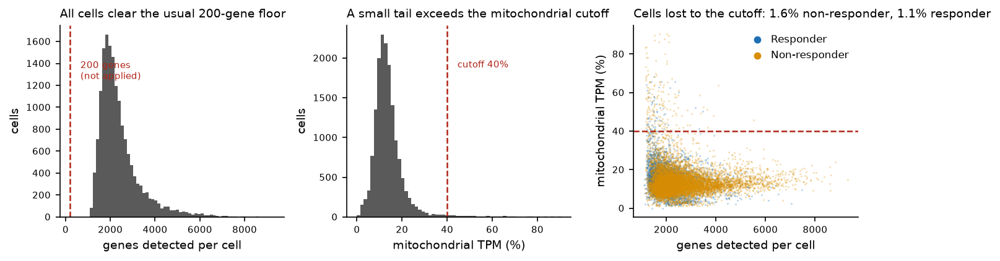
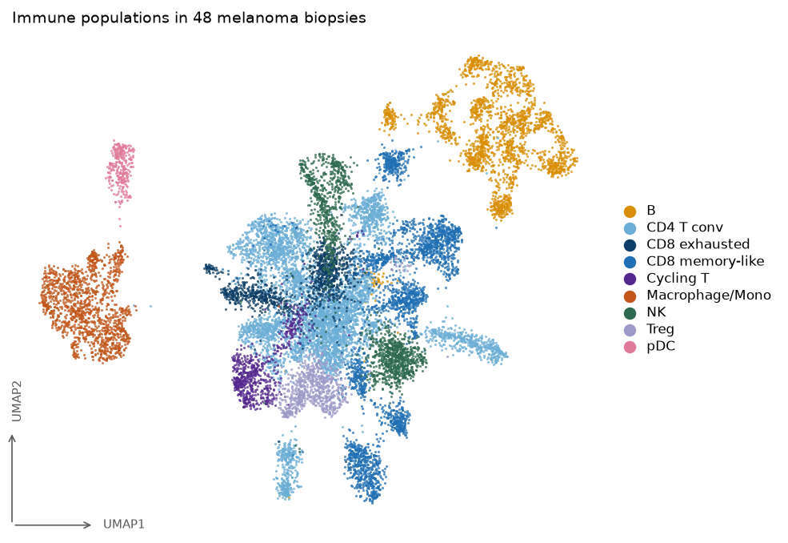
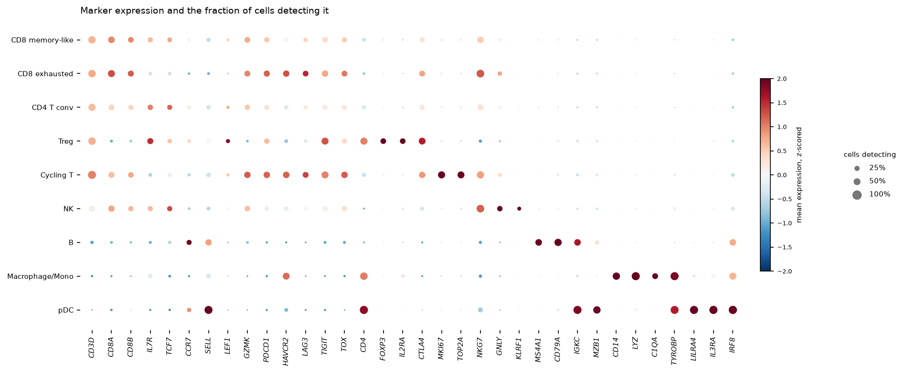
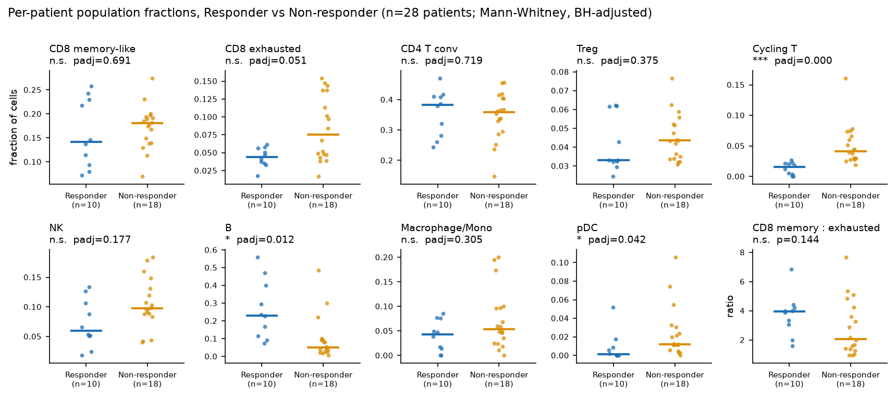
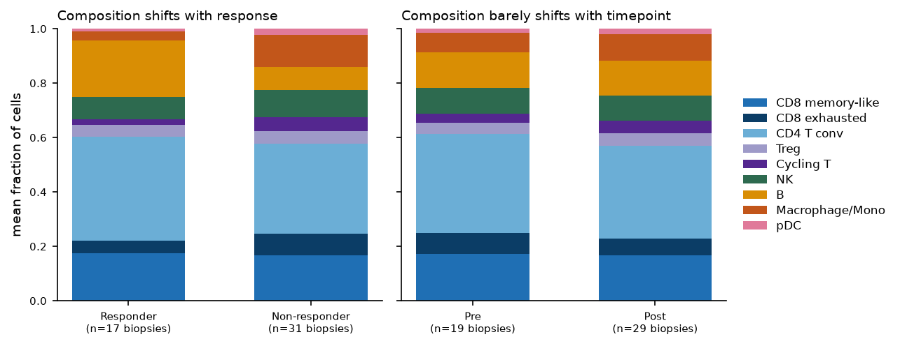
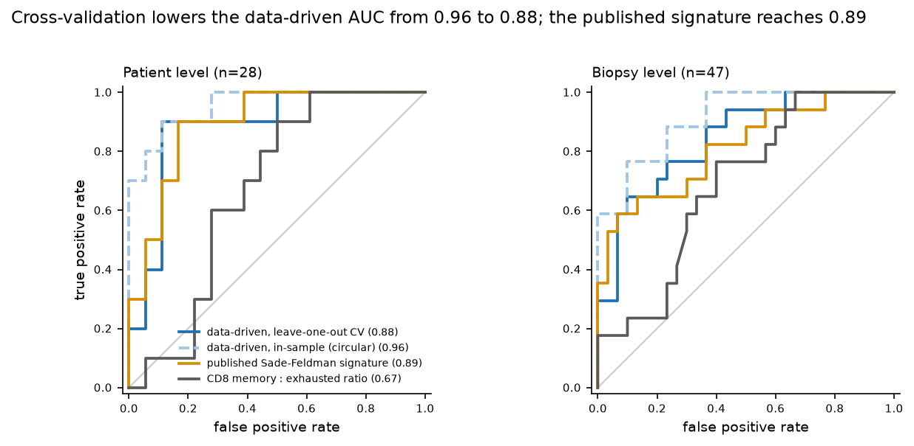
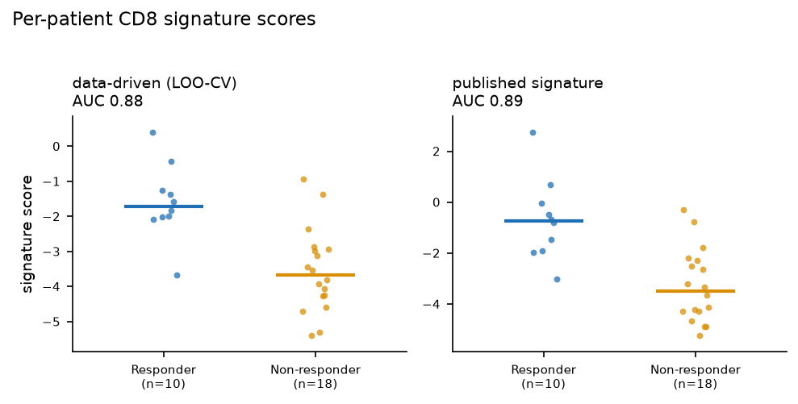

# Immune composition and CD8 state in melanoma before and during checkpoint blockade

A reproduction of the "scRNA-seq Immunotherapy Tumor Response Analysis"
example, carried out under the rules in [WORKSPACE.md](../WORKSPACE.md).
Every number below is read from `results/` by
[workflows/07_report.py](../workflows/07_report.py) when the report is
written; none is typed in by hand.

## Dataset

**Sade-Feldman M, et al. Defining T cell states associated with response to checkpoint immunotherapy in melanoma. Cell 175:998-1013 (2018).**
Accession **GSE120575**, expression as released in log2(TPM+1).

| | |
|---|---|
| Cells, as released | 16,291 |
| Cells after QC | 16,060 |
| Genes, as released | 55,737 |
| Genes after QC | 45,692 |
| Patients | 32 |
| Biopsies | 48 (19 Pre, 29 Post) |
| Biopsies by response | 17 Responder, 31 Non-responder |
| Cells from FACS-enriched fractions | 991 in 9 biopsies |

The last row is not in the released annotation file. The expression matrix
carries a second header row recording that nine Post biopsies were sorted
into T-cell- or myeloid-enriched fractions; the annotation file collapses
that away. Proportions measured inside a sorted fraction reflect the gate
rather than the tumour, so the label is recovered in
[step 01](../workflows/01_build_anndata.py) and carried through as a
covariate.

## Quality control

| stage | n_cells | n_genes | cells_removed | genes_removed |
|---|---|---|---|---|
| 00_loaded | 16291 | 55737 | 0 | 0 |
| 01_mito_filter | 16060 | 55737 | 231 | 0 |
| 02_gene_filter | 16060 | 45692 | 0 | 10045 |

Mitochondrial content is computed in linear TPM space, because a percentage
taken over log2(TPM+1) values is not a fraction of transcripts. The authors
released an already-curated set, so no gene-count filter is applied; the
conventional 200-gene floor is drawn on the figure and removes nothing.



## Is the comparison confounded?

Checked before the composition results were read:

| variable | test | p | detail |
|---|---|---|---|
| therapy | chi-square | 0.0653 | anti-CTLA4: 1 Non-responder, 1 Responder; anti-CTLA4+PD1: 4 Non-responder, 7 Responder; anti-PD1: 26 Non-responder, 9 Responder |
| timepoint | chi-square | 0.2745 | Post: 21 Non-responder, 8 Responder; Pre: 10 Non-responder, 9 Responder |
| sort_fractions | chi-square | 0.1448 | T_enriched+unsorted: 5 Non-responder, 2 Responder; myeloid_enriched+unsorted: 0 Non-responder, 2 Responder; unsorted: 26 Non-responder, 13 Responder |
| n_cells_per_biopsy | Mann-Whitney | 0.1884 | median Responder 333 vs Non-responder 349 |
| biopsies_per_patient | none (structural) | nan | 32 patients; 1 biopsies: 19 patients; 2 biopsies: 10 patients; 3 biopsies: 3 patients |

No candidate confounder is associated with response. The structural problem
is the last row: 48 biopsies come from 32
patients, so they are not independent replicates.

## Cell populations

9 populations were resolved from 28 Leiden
clusters by the hierarchical marker scoring in
[step 04](../workflows/04_annotate.py).

| Population | Cells | % of cells |
|---|---|---|
| CD4 T conv | 5560 | 34.6 |
| CD8 memory-like | 2686 | 16.7 |
| B | 2137 | 13.3 |
| NK | 1471 | 9.2 |
| Macrophage/Mono | 1410 | 8.8 |
| CD8 exhausted | 1106 | 6.9 |
| Treg | 738 | 4.6 |
| Cycling T | 660 | 4.1 |
| pDC | 292 | 1.8 |





## Which populations differ with response

The experimental unit is the **patient** (n = 28: 10
Responder, 18 Non-responder). Four patients whose own
biopsies carry contradictory response labels are excluded, because response
in this dataset is recorded per lesion and they have no patient-level label.
The biopsy-level column reproduces the unit the reference example used, and
the last column repeats the patient-level test after dropping every
FACS-enriched biopsy.

Values are median fractions of cells; p-values are Mann-Whitney,
BH-adjusted within each comparison.

| Population | Responder | Non-responder | Direction | padj (patient) | padj (biopsy) | padj (unsorted only) |
|---|---|---|---|---|---|---|
| Cycling T | 0.0152 | 0.0408 | up in Non-responder | 0.0005 | 0.0005 | 0.0031 |
| B | 0.2313 | 0.0517 | up in Responder | 0.0123 | 0.0186 | 0.0097 |
| pDC | 0.0011 | 0.0121 | up in Non-responder | 0.0420 | 0.0262 | 0.0402 |
| CD8 exhausted | 0.0439 | 0.0755 | up in Non-responder | 0.0512 | 0.0262 | 0.0688 |
| CD8 memory-like : CD8 exhausted ratio | 3.9426 | 2.0743 | up in Responder | 0.1436 | 0.0345 | nan |
| NK | 0.0594 | 0.0979 | up in Non-responder | 0.1766 | 0.3256 | 0.0402 |
| Macrophage/Mono | 0.0432 | 0.0538 | up in Non-responder | 0.3054 | 0.0186 | 0.0696 |
| Treg | 0.0330 | 0.0435 | up in Non-responder | 0.3747 | 0.7674 | 0.7875 |
| CD8 memory-like | 0.1416 | 0.1806 | up in Non-responder | 0.6915 | 0.8631 | 0.7875 |
| CD4 T conv | 0.3830 | 0.3579 | up in Responder | 0.7191 | 0.2230 | 0.4504 |

**Surviving at patient level:** Cycling T (Non-responder, padj 0.000), B (Responder, padj 0.012), pDC (Non-responder, padj 0.042).

**Significant at biopsy level but not at patient level:** CD8 exhausted (biopsy 0.026 -> patient 0.051), CD8 memory-like : CD8 exhausted ratio (biopsy 0.034 -> patient 0.144), Macrophage/Mono (biopsy 0.019 -> patient 0.305).

That difference is the whole point of the correction. Those populations were
not supported by 28 independent patients; they were supported by
repeated biopsies of the same patients.





## Does treatment itself change composition?

No. Across 29 patients biopsied both before and during treatment, a
paired signed-rank test finds no population shifting between timepoints
(smallest padj 0.290), and the unpaired biopsy-level test agrees. This
reproduces the reference example's null result. Responders and
non-responders remodel their immune compartment in different directions, so
pooling the timepoint across response groups cancels the effect.

## A signature that stratifies response

Derived from per-patient CD8 pseudobulk profiles
(25 genes per direction inside each
cross-validation fold, 20 for
reporting).

**Responder-up:** `IL7R`, `CCR7`, `GPR183`, `CD55`, `ATM`, `TCF7`, `RGPD5`, `FOXP1`, `SELL`, `MGAT4A`, `PER1`, `EPB41`, `CD44`, `PLAC8`, `LEF1`, `TMEM50B`, `AMICA1`, `NR4A1`, `SORL1`, `EGR1`

**Responder-down:** `NKG7`, `GZMA`, `GZMB`, `PRF1`, `CTSW`, `PSMB9`, `GZMH`, `CLIC1`, `HLA-DPA1`, `MT2A`, `STAT1`, `APOBEC3G`, `CCL4`, `CST7`, `LSP1`, `GBP5`, `IL32`, `CCL5`, `IFITM1`, `PPP1CA`

The two lists are a memory/progenitor CD8 programme against a terminal
cytotoxic and interferon-driven one.

| Signature | AUC (patient, n=28) | AUC (biopsy, n=47) |
|---|---|---|
| Data-driven, leave-one-out CV | **0.883** | 0.843 |
| Data-driven, in-sample (circular) | 0.956 | 0.912 |
| Published Sade-Feldman signature | 0.894 | 0.814 |
| CD8 memory : exhausted ratio | 0.672 | 0.688 |

The cross-validated figure is the honest one: within each fold the signature
is re-derived without the held-out patient. The in-sample row is what
the same procedure reports when it scores the samples it was built from. That
the independently published signature reaches
0.894 on the same patients
corroborates the biology rather than the fitting procedure.





No single gene survives BH correction across the 41,744 genes tested at
patient level (smallest padj 0.122), although the rank test
could in principle reach 1.5e-07 at this n. The response signal is
distributed across many genes rather than concentrated in any one, which is
why an aggregate score separates the groups where single-gene testing does
not.

## How this compares with the reference example

Reproduced closely: the cohort (16,291 cells, 32
patients, 48 biopsies), the QC outcome (16,060 cells and
45,692 genes, identical), the set of nine populations, the null
result for Pre versus Post, and the biopsy-level signature AUC
(0.843 here against 0.859 there). The
signature genes were recovered independently: 11 of the example's 13
responder-up genes and 11 of its 15 responder-down genes.

Diverged, for reasons recorded in [DECISIONS.md](DECISIONS.md):

1. **The experimental unit.** The example tested 48 biopsies as independent
   observations. They come from 32 patients, so this analysis tests patients
   and reports the biopsy-level result beside it. Three of the example's
   findings do not survive.
2. **A confounder the labels hide.** The FACS sorting fractions are
   recovered and tested rather than silently averaged in.
3. **Annotation.** A flat argmax over overlapping marker panels mislabels
   cytotoxic T cells as NK and loses the real NK cluster; scoring is
   calibrated within each level of a hierarchy instead.
4. **CD8 states are assigned per cluster, not per cell**, since the
   memory-exhaustion axis is a continuum.

## Caveats

- Cross-sectional biopsies, mixed therapy regimens, mixed timepoints. These
  AUCs are associative, not a prospective classifier.
- n = 28 patients, with 10 responders. Small
  enough that signature membership moves between folds even where the
  aggregate score is stable.
- CD4 mRNA is captured poorly relative to CD8A, so the CD4/CD8 boundary rests
  on relative rather than absolute panel scores; CD4 T conv is the largest
  population and may absorb weakly-labelled CD8 cells.
- CD45-gated Smart-seq2 data: immune cells only, no tumour or stromal
  compartment.
- The four patients with contradictory response labels are excluded from the
  patient-level response test. They are retained everywhere else.

## Reproducing

```bash
conda env create -f environment/env-scrna.yml
conda activate scrna
bash workflows/run_all.sh
```

Inputs are downloaded from GEO and checksum-verified against
[data/metadata/SOURCES.md](../data/metadata/SOURCES.md). Parameters are in
[configs/scrnaseq.yaml](../configs/scrnaseq.yaml); the random seed is
42, set in [configs/project.yaml](../configs/project.yaml).
